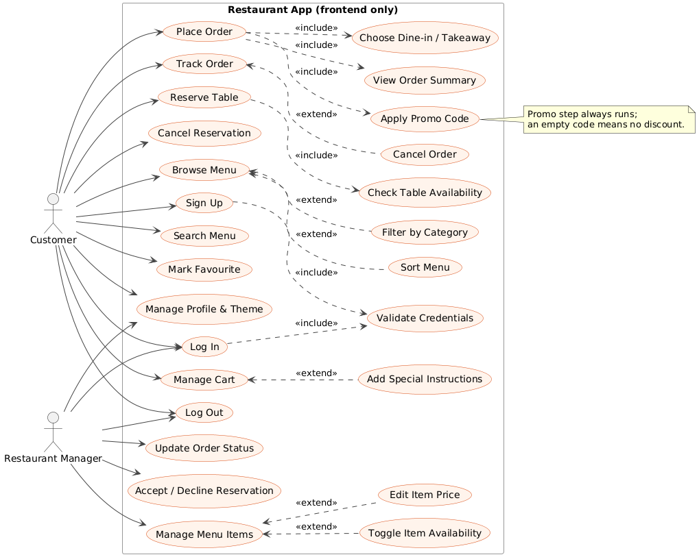
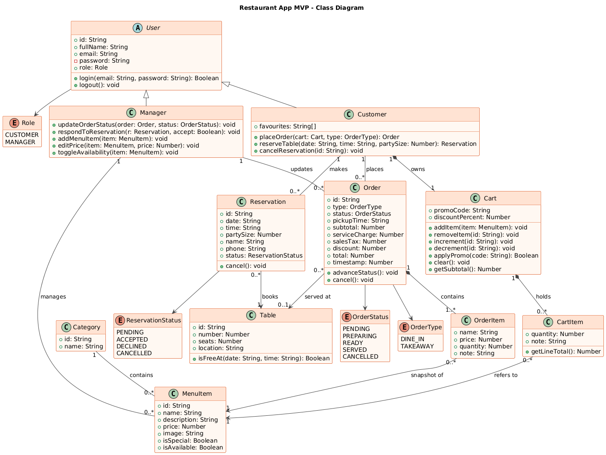
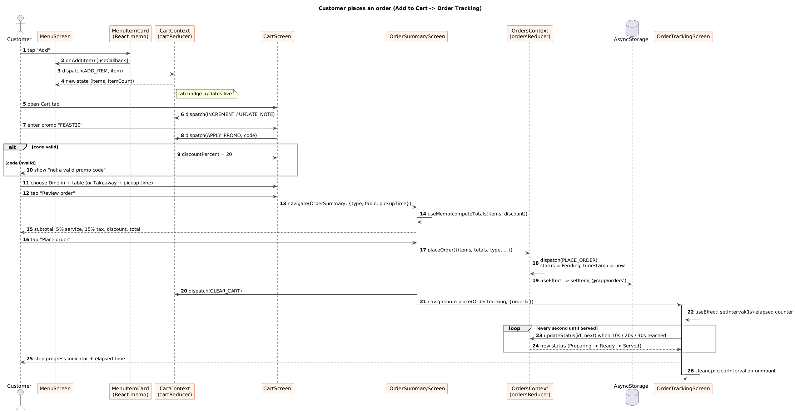
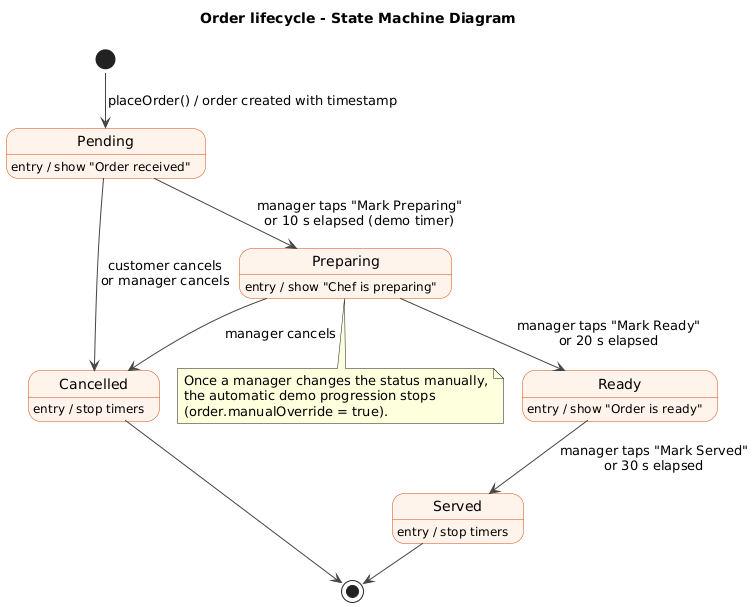
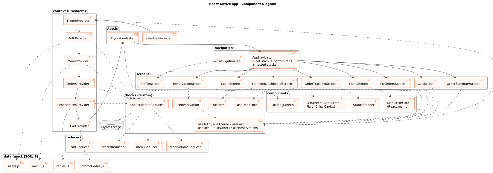

| | |
|---|---|
| **Project** | Restaurant App MVP ("Dastarkhwan") |
| **Document version** | 1.0 |
| **Release covered** | MVP v1.0.0 (frontend prototype) |
| **Platform** | React Native with Expo SDK 57 (Android, iOS, Expo Go) |
| **Repository** | github.com/zacka0334-svg/restaurant-app-mvp |
| **Student name** | Sikander Hayat |
| **Registration no.** | 9315 |
| **Date** | September 2026 |

# 0. Client Meeting: Self-Interview as a Customer

Before writing any requirement, I interviewed myself as a hungry customer who is always short on time. The answers below are the "client meeting" and every requirement in this document traces back to them (the tag in brackets is the user story it produced).

| # | Question I asked myself | My answer as a customer | Leads to |
|-|-------|------------|---|
| Q1 | What annoys you most when you eat out? | Waiting in a queue to read a paper menu and then waiting again for the waiter to take the order. | US-01, US-04 |
| Q2 | What would you check first in the app? | Today's specials and whether a dish is actually available before I get excited about it. | US-01 |
| Q3 | How do you decide what to eat? | I usually know what I want, e.g. "karahi", so I need a quick search and category filters, and a way to sort by price when I'm on a budget. | US-02 |
| Q4 | Would you order before arriving? | Yes. I want to book a table for 7:00 PM and have my food being prepared when I arrive, or pick up a takeaway at a fixed time. | US-05, US-06 |
| Q5 | Anything special about your order? | I often ask for "no onions" or "less spicy", so I need a note per dish. | US-03 |
| Q6 | What about discounts? | If the restaurant gives me a promo code I want to see exactly how much I save, including tax and service charge, before confirming. | US-04 |
| Q7 | After ordering, what do you want to know? | Whether the kitchen has started, and roughly how long it has been, without calling the restaurant. | US-07 |
| Q8 | What would make you keep the app? | Saving favourite dishes, and a dark mode for late-night orders. | US-08, US-09 |
| Q9 | What would make you delete the app? | Slow loading, crashes, confusing error messages, or losing my booking when I close the app. | NFR-01…NFR-12 |

I also briefly took the manager's view (from the brief: "I struggle with phone-in orders"): a manager needs one screen that shows incoming orders, lets them accept or decline table bookings, and lets them change prices or mark a dish as sold out without calling a developer (US-11 to US-14).

# 1. Introduction

## 1.1 Purpose

This document specifies the requirements of the **Restaurant App MVP version 1.0**, a frontend-only React Native prototype that lets diners browse a restaurant's menu, search it, manage a cart, apply promo codes, place dine-in or takeaway orders, reserve tables and track their order, and lets a restaurant manager handle incoming orders, reservations and the menu from a dashboard.

The intended audience is: (a) the course instructor and teaching assistants who evaluate the assignment, (b) the student developer who implements the app, and (c) any future developer who would connect this frontend to a real backend. The document covers release **v1.0.0** of the repository `restaurant-app-mvp`.

## 1.2 Scope

**In scope for v1.0 (all implemented on the client only):**

1. Login and sign-up with email and password, with client-side validation and two roles (Customer, Manager), checked against a mock users list.
2. Role-based navigation: customers land on the Menu, managers land on the Manager Dashboard.
3. Menu browsing with a simulated 1.5-second network load, loading and error states with Retry, pull-to-refresh, category chips, "Daily Special" badges and greyed-out unavailable items.
4. Search with a 400 ms debounce, recent-search suggestions, sorting (price low→high, high→low, name A→Z), a "Back to top" button and an empty state.
5. Favourite (heart) toggle on each dish.
6. Cart with add, remove, quantity stepper, per-item special instructions, promo codes (WELCOME10, FEAST20) and a live badge on the Cart tab.
7. Order summary with subtotal, 5 % service charge, 15 % sales tax, promo discount and grand total.
8. Placing a Dine-in (with table) or Takeaway (with pickup time) order.
9. Order tracking with a step progress indicator, an elapsed-time counter, and automatic demo progression Pending → Preparing (10 s) → Ready (20 s) → Served (30 s).
10. Table reservation for hourly slots 12:00–22:00 with availability checks, validation, a confirmation modal, and a "My reservations" list with cancellation.
11. Profile screen with user details, a light/dark theme switch and logout.
12. Manager Dashboard with three tabs: Incoming Orders (change status), Reservations (accept or decline) and Menu Management (add item, edit price, toggle availability).
13. Local persistence of users, orders, reservations and menu edits with AsyncStorage, with a loading screen until data is restored.

**Out of scope for v1.0:**

- Any backend service, database, REST/GraphQL API or cloud function.
- Real authentication (passwords are compared in plain text against mock data; no tokens, no password reset, no email verification).
- Real payments, wallets or card processing; payment is assumed to be made at the restaurant.
- Push notifications, SMS or email confirmations.
- Multi-restaurant or multi-branch support, delivery and rider tracking.
- Real-time sync between two different phones (state is shared only inside one installation of the app).
- Image upload; dishes use emoji as images so the app works fully offline.
- Third-party state management libraries (Redux, MobX, Zustand) — only React hooks and Context are used.

## 1.3 Definitions and Acronyms

| Term | Definition |
|---|--------|
| **SRS** | Software Requirements Specification — this document, which states what the system must do. |
| **MVP** | Minimum Viable Product — the smallest version of the app that delivers the core value (browse, order, reserve, track). |
| **UML** | Unified Modeling Language — the standard notation used for the diagrams in Section 6. |
| **React Native (RN)** | A framework for building native mobile apps with JavaScript and React components. |
| **Expo / Expo Go** | A toolchain around React Native; Expo Go is a phone app that runs the project without building native code. |
| **Hook** | A React function whose name starts with `use` (e.g. `useState`) that lets a function component hold state or run side effects. |
| **Custom hook** | A developer-written hook (e.g. `useForm`, `useDebounce`, `useReservation`) that packages reusable logic and returns data, never JSX. |
| **Context** | React's Context API: a way to share a value (e.g. the logged-in user or theme) with any component without passing props through every level. |
| **Provider** | The component (e.g. `AuthProvider`) that supplies a context value to everything inside it. |
| **Reducer** | A pure function `(state, action) => newState` used with `useReducer`; it never mutates the previous state. |
| **Action / Dispatch** | An action is an object like `{ type: 'ADD_ITEM', payload }`; `dispatch` sends it to the reducer. |
| **Mock Data** | Hard-coded JavaScript data (in `src/data`) that stands in for a database or API. |
| **FlatList** | React Native's virtualised list component that renders only the rows visible on screen. |
| **AsyncStorage** | A simple, persistent key–value store on the device, used here instead of a database. |
| **Debounce** | Delaying an action (search) until the user has stopped typing for a set time (400 ms). |
| **Memoization** | Caching a computed value (`useMemo`), a function (`useCallback`) or a component render (`React.memo`) so it is not recomputed unnecessarily. |
| **FR / NFR** | Functional Requirement / Non-Functional Requirement. |
| **PKR / Rs** | Pakistani Rupee, the currency used for all prices. |

# 2. Overall Description

## 2.1 User Roles

| Role | Key Permissions & Goals |
|--|---------|
| **Customer (Diner)** | *Goals:* find food quickly, avoid queues, order ahead and know when food is ready. *Permissions:* sign up / log in; browse, search, filter and sort the menu; mark favourites; manage own cart and apply promo codes; place Dine-in or Takeaway orders; track and cancel own pending orders; create and cancel own reservations; change theme; log out. Cannot see the Manager Dashboard or other customers' data. |
| **Restaurant Manager** | *Goals:* digitise the menu, stop taking phone-in orders, and manage reservations efficiently. *Permissions:* log in (or sign up with the Manager role); view all incoming orders and move them through Preparing → Ready → Served or cancel them; accept or decline reservation requests; add menu items, edit prices and toggle availability (changes appear instantly on the customer menu); change theme; log out. The Dashboard tab is shown only to this role. |

## 2.2 User Stories

Stories US-01 to US-09 come directly from the self-interview in Section 0. US-11 to US-14 are the Restaurant Manager's stories.

| ID | User story | Source |
|-|--------|--|
| US-01 | As a **customer**, I want to see today's specials and which dishes are unavailable, so that I only choose food I can actually get. | Interview Q1, Q2 |
| US-02 | As a **customer**, I want to search the menu and filter by category and price, so that I find what I want in a few seconds. | Interview Q3 |
| US-03 | As a **customer**, I want to add a special instruction such as "no onions" to each dish, so that my food is made the way I like it. | Interview Q5 |
| US-04 | As a **customer**, I want to apply a promo code and see the tax, service charge and final total before I confirm, so that there are no surprises on the bill. | Interview Q1, Q6 |
| US-05 | As a **customer**, I want to book a table for a specific time such as 7:00 PM, so that a table is ready when I arrive. | Interview Q4 |
| US-06 | As a **customer**, I want to choose Dine-in or Takeaway with a pickup time, so that my food is ready exactly when I need it. | Interview Q4 |
| US-07 | As a **customer**, I want to see my order's live status and how long it has been, so that I don't have to call the restaurant. | Interview Q7 |
| US-08 | As a **customer**, I want to save dishes as favourites, so that I can reorder them quickly next time. | Interview Q8 |
| US-09 | As a **customer**, I want a dark mode, so that the app is comfortable to use at night. | Interview Q8 |
| US-10 | As a **customer**, I want to cancel a reservation I no longer need, so that the table is freed for others. | Interview Q4 |
| US-11 | As a **restaurant manager**, I want to see all incoming orders and update their status, so that customers know when food is being prepared and ready. | Brief (manager) |
| US-12 | As a **restaurant manager**, I want to accept or decline table reservations, so that I control how full the restaurant gets. | Brief (manager) |
| US-13 | As a **restaurant manager**, I want to mark a dish as unavailable when it runs out, so that customers cannot order it. | Brief (manager) |
| US-14 | As a **restaurant manager**, I want to add new dishes and change prices myself, so that the digital menu is always up to date without a developer. | Brief (manager) |

# 3. Functional Requirements

Each requirement is testable on the running prototype.

### 3.1 Authentication

- **FR-01** The system shall display a single screen that switches between Login and Sign-up modes when the user taps the mode toggle.
- **FR-02** The system shall reject an email that does not match the pattern `name@domain.tld` and show the message "Enter a valid email address" under the field.
- **FR-03** The system shall reject a password shorter than 8 characters or without at least one digit and show an error under the password field.
- **FR-04** The system shall, in Sign-up mode, reject the form when Password and Confirm Password differ and require full name and a role (Customer or Manager).
- **FR-05** The system shall clear the error of a field as soon as the user edits that field.
- **FR-06** The system shall simulate a 1-second network delay on submit, show an activity indicator and disable the submit button during that time.
- **FR-07** The system shall navigate a Customer to the Menu tab and a Manager to the Dashboard tab after a successful login, and show an alert with a clear message when credentials are wrong or the email is already registered.
- **FR-08** The system shall return the user to the Login screen and reset the navigation stack when the user logs out.

### 3.2 Menu

- **FR-09** The system shall load the menu from a simulated request that resolves after 1.5 seconds, showing a loading indicator meanwhile.
- **FR-10** The system shall show an error message and a Retry button when the simulated request fails.
- **FR-11** The system shall show horizontal category chips (All, Starters, Mains, Desserts, Drinks) and display only the items of the selected category.
- **FR-12** The system shall show a "Daily Special" badge on items with `isSpecial = true` and show items with `isAvailable = false` greyed out with a disabled Add button.
- **FR-13** The system shall reload the menu when the user pulls the list down (pull-to-refresh).
- **FR-14** The system shall show the number of currently displayed items in the screen header, e.g. "Menu (16)".
- **FR-15** The system shall let the customer toggle a favourite (heart) on each dish.

### 3.3 Search

- **FR-16** The system shall filter the menu by name or description 400 ms after the user stops typing in the search bar.
- **FR-17** The system shall focus the search input when the search icon is tapped and keep focus after the clear button empties it.
- **FR-18** The system shall show the last five distinct search terms as tappable suggestions when the search input is focused and empty.
- **FR-19** The system shall sort the list by price low→high, price high→low or name A→Z when the corresponding option is selected.
- **FR-20** The system shall show a "Back to top" button after the list is scrolled more than 300 px, and a friendly empty-state message when no item matches.

### 3.4 Cart

- **FR-21** The system shall add a menu item to the cart when Add is tapped, increasing its quantity if already present, and show the total item count as a badge on the Cart tab.
- **FR-22** The system shall let the customer increase or decrease quantity, and remove the item when its quantity reaches zero or the remove button is tapped.
- **FR-23** The system shall store a free-text special instruction for each cart line.
- **FR-24** The system shall accept the promo codes WELCOME10 (10 %) and FEAST20 (20 %) and reject any other code with an error message.

### 3.5 Orders

- **FR-25** The system shall calculate subtotal, promo discount, 5 % service charge and 15 % sales tax on the discounted subtotal, and the grand total, on the Order Summary screen.
- **FR-26** The system shall require a table for Dine-in orders and a pickup time for Takeaway orders before the order can be reviewed.
- **FR-27** The system shall create an order with id, items, totals, type, status "Pending" and timestamp when the customer taps Place Order, and empty the cart.
- **FR-28** The system shall move an order automatically to Preparing after 10 s, Ready after 20 s and Served after 30 s (demo timings) unless a manager has changed its status manually.
- **FR-29** The system shall show a four-step progress indicator and an elapsed-time counter that updates every second on the Order Tracking screen.
- **FR-30** The system shall let a customer cancel an order while it is still Pending, and list the customer's own orders under the Orders tab.

### 3.6 Reservation

- **FR-31** The system shall offer hourly time slots from 12:00 to 22:00 for the next seven days and disable a slot when no free table has enough seats, or when it is less than one hour away.
- **FR-32** The system shall validate that the date is not in the past, the party size is between 1 and 12, the phone number matches `03XX-XXXXXXX`, and the booking is at least one hour ahead.
- **FR-33** The system shall show a confirmation modal summarising date, time, guests, table and contact details before saving a reservation.
- **FR-34** The system shall list the customer's reservations and cancel one after the customer confirms in an alert.

### 3.7 Manager Dashboard

- **FR-35** The system shall show the Dashboard tab only when the logged-in user's role is Manager.
- **FR-36** The system shall list incoming orders with buttons to move each order to its next status or cancel it (Incoming Orders tab).
- **FR-37** The system shall let the manager accept or decline pending reservations (Reservations tab).
- **FR-38** The system shall let the manager add a menu item, edit an item's price and toggle its availability, and these changes shall appear on the customer menu immediately (Menu Management tab).
- **FR-39** The system shall persist orders, reservations, menu edits and signed-up users in AsyncStorage and restore them on app start, showing a loading screen until restoring is complete.

### 3.8 Profile and Theme

- **FR-40** The system shall show the logged-in user's name, email and role on the Profile screen, with a switch that toggles light and dark mode for every screen instantly.

# 4. Non-Functional Requirements

| ID | Category | Requirement |
|-|--|---------|
| NFR-01 | Usability | Every primary action (Add, Review order, Place order, Review booking) shall be reachable in at most 3 taps from the tab it belongs to. |
| NFR-02 | Usability | All validation messages shall appear directly under the related field in plain language (e.g. "Use the format 03XX-XXXXXXX"), and destructive actions (clear cart, cancel order, cancel reservation, logout) shall ask for confirmation. |
| NFR-03 | Usability / Accessibility | Tap targets shall be at least 34 × 34 dp, icon-only buttons shall have an `accessibilityLabel`, and text shall meet readable contrast in both light and dark themes. |
| NFR-04 | Performance — screen load | After the simulated 1.5 s menu request, the Menu screen shall render its first items in under 300 ms on a mid-range Android phone; all other screens shall open in under 300 ms. |
| NFR-05 | Performance — list scroll | The menu shall use `FlatList` (virtualised) with a stable `keyExtractor`; `MenuItemCard` shall be wrapped in `React.memo` with `useCallback` handlers so that toggling one favourite re-renders only that card, keeping scrolling smooth at 60 fps. |
| NFR-06 | Performance — search | Filtering shall run at most once per 400 ms pause in typing (debounce), and derived lists and totals shall be computed with `useMemo`. |
| NFR-07 | Responsiveness | Layouts shall use Flexbox and percentage/`flex` widths (no fixed screen widths) so that the app works on small phones (360 dp wide), large phones and tablets in portrait; forms are limited to 480 dp wide and centred on tablets. |
| NFR-08 | Responsiveness | Screens shall respect safe areas (notches, status bar, home indicator) using `react-native-safe-area-context`. |
| NFR-09 | Maintainability — structure | Source code shall be organised under `src/` in `components`, `screens`, `context`, `reducers`, `hooks`, `data` and `navigation` folders, one screen per file. |
| NFR-10 | Maintainability — reuse | Shared UI (Screen, AppButton, Field, Chip, Card, EmptyState, MenuItemCard, StatusStepper) and logic (useForm, useDebounce, useReservation, usePersistentReducer) shall be reused rather than duplicated; reducers shall be pure and unit-tested with Jest. |
| NFR-11 | Data handling without a backend | All data shall come from mock files in `src/data` and live in React state (Context + `useReducer`); orders, reservations, menu edits and new users shall be saved to AsyncStorage on every change and restored on start. If stored data is missing or unreadable, the app shall fall back to the seed mock data without crashing. |
| NFR-12 | Reliability | Every timer and interval (`setTimeout`, `setInterval`) shall be cleared in the cleanup function of its `useEffect`, so no state update happens after a screen unmounts. |
| NFR-13 | Portability | The app shall run in Expo Go on Android and iOS and on an Android emulator using Expo SDK 57, with no native code changes. |
| NFR-14 | Security (prototype level) | Passwords shall never be stored in the logged-in session object and shall be masked with a show/hide toggle; the SRS acknowledges that real security requires a backend (out of scope). |

# 5. Client-Side Data Model (Mock Data)

No database is used. The data sets below are JavaScript modules in `src/data/` (seed data) and are held in React state through Context providers. Data sets marked *persisted* are saved to AsyncStorage under the key shown.

| Data Set Name | Fields | Description |
|---|-----|----|
| **Users** (`src/data/users.js`, persisted `@dastarkhwan/users`) | `id: string`, `fullName: string`, `email: string`, `password: string`, `role: 'customer' or 'manager'` | Registered accounts used for login. Seeded with 2 customers and 1 manager; sign-ups are appended in `AuthContext`. |
| **Categories** (`src/data/menu.js`) | `id: string`, `name: string` | Menu groups shown as chips: All, Starters, Mains, Desserts, Drinks. |
| **MenuItems** (`src/data/menu.js`, persisted `@dastarkhwan/menu`) | `id`, `name`, `description`, `price: number (Rs)`, `category: categoryId`, `image: emoji`, `isSpecial: boolean`, `isAvailable: boolean` | 16 dishes across 4 categories. Held in `MenuContext`; the manager can add items, edit prices and toggle availability. |
| **Tables** (`src/data/tables.js`) | `id`, `number: number`, `seats: number`, `location: string` | 7 tables seating 2 to 12 people; used for dine-in orders and reservation availability. |
| **Reservations** (`src/data/tables.js` seed, persisted `@dastarkhwan/reservations`) | `id`, `customerId`, `name`, `phone`, `date: 'YYYY-MM-DD'`, `time: 'HH:00'`, `partySize: 1–12`, `tableId`, `status: Pending or Accepted or Declined or Cancelled`, `createdAt: timestamp` | Table bookings. Seeded so that tomorrow 20:00 is fully booked (slot shown disabled). Held in `ReservationsContext`. |
| **Orders** (persisted `@dastarkhwan/orders`) | `id`, `customerId`, `customerName`, `items: [{id, name, price, quantity, note}]`, `totals: {subtotal, discount, serviceCharge, salesTax, grandTotal}`, `total`, `promoCode`, `type: Dine-in or Takeaway`, `tableId`, `pickupTime`, `status`, `timestamp`, `manualOverride: boolean`, `history: [{status, at, by}]` | Placed orders, held in `OrdersContext` (`useReducer`). Starts empty. |
| **Cart** (in memory, `CartContext`) | `items: [{id, name, price, image, quantity, note}]`, `promoCode: string or null`, `discountPercent: number` | The current customer's basket, managed by `cartReducer`. Not persisted (cleared on logout). |
| **PromoCodes** (`src/data/promoCodes.js`) | `code → discountPercent` | `WELCOME10 → 10`, `FEAST20 → 20`. |

# 6. UML Diagrams

All diagrams were produced with PlantUML and exported as PNG files to `A1/UML`.

## 6.1 Use Case Diagram

**Figure 1** shows the two actors and 26 use cases inside the app boundary. The Customer signs up, logs in, browses, searches, manages the cart, places and tracks orders, reserves tables and manages the profile; the Restaurant Manager logs in, updates order status, accepts or declines reservations and manages menu items. *Include* relationships mark steps that always happen: Place Order includes Apply Promo Code, View Order Summary and Choose Dine-in/Takeaway; Reserve Table includes Check Table Availability; Log In and Sign Up include Validate Credentials. *Extend* relationships mark optional behaviour: Filter by Category and Sort Menu extend Browse Menu, Add Special Instructions extends Manage Cart, Cancel Order extends Track Order, and Edit Item Price / Toggle Item Availability extend Manage Menu Items.

## 6.2 Class Diagram

**Figure 2** models the domain. The abstract class `User` holds shared attributes and is specialised by `Customer` and `Manager` (inheritance). A `Category` contains many `MenuItem`s. Each Customer owns exactly one `Cart` (composition), which holds 0..* `CartItem`s that refer to a MenuItem. A Customer places 0..* `Order`s; an Order is composed of 1..* `OrderItem`s (a price snapshot of MenuItems), may be served at 0..1 `Table`, and has an `OrderStatus` and `OrderType`. A Customer makes 0..* `Reservation`s, each booking exactly one Table. The Manager updates Orders and manages MenuItems. In code these classes are plain JavaScript objects inside reducers, and the operations are reducer actions.

## 6.3 Sequence Diagram — "Customer places an order"

**Figure 3** follows one order from tapping *Add* on a `MenuItemCard` to the `OrderTrackingScreen`. The memoised card calls a stable `useCallback` handler on `MenuScreen`, which dispatches `ADD_ITEM` to the `CartContext` reducer; the tab badge updates. On the Cart screen the customer changes quantities, adds notes, applies a promo code (valid/invalid alternatives are shown in the *alt* frame) and chooses Dine-in or Takeaway. The Order Summary computes totals with `useMemo`; *Place order* calls `placeOrder` in `OrdersContext`, which dispatches `PLACE_ORDER`, persists to AsyncStorage, clears the cart and replaces the screen with Order Tracking. The *loop* frame shows the interval that advances the status and the elapsed counter until the order is Served, and the cleanup that clears the intervals.

## 6.4 State Machine Diagram — Order lifecycle

**Figure 4** shows the five order states. An order is created in **Pending**. It moves to **Preparing**, then **Ready**, then **Served** either when the manager taps the matching button or when the demo timer reaches 10 s, 20 s and 30 s after placement. An order can be **Cancelled** from Pending (by the customer or manager) or from Preparing (by the manager). Served and Cancelled are final states in which all timers stop. The same allowed transitions are enforced in code by `canTransition()` in `ordersReducer.js`.

## 6.5 Component Diagram

**Figure 5** shows how the app is assembled. `App.js` nests the providers (Theme → Auth → Menu → Orders → Reservations → Cart) and a `HydrationGate` that shows the `LoadingScreen` until AsyncStorage data is restored, then renders `AppNavigator` (root stack + bottom tabs + nested stacks). Screens depend on context consumer hooks (`useAuth`, `useTheme`, `useCart`, `useMenu`, `useOrders`, `useReservations`) and on custom hooks (`useForm`, `useDebounce`, `useReservation`). Providers depend on reducers, and the persisted providers use `usePersistentReducer`, which reads and writes AsyncStorage. Mock data files seed the providers, and shared components (`MenuItemCard`, `ui`, `StatusStepper`) are reused across screens.

# 7. MVP Frontend Development (React Native)

## 7.1 Login and Signup Screen (Question 3)

- **Purpose:** authenticate existing users and register new ones as Customer or Manager.
- **UI elements:** logo and title; Login / Sign-up segmented toggle; Full name (sign-up); Email; Password with show/hide eye icon; Confirm password and role selector Customer / Manager (sign-up); submit button with `ActivityIndicator`; switch-mode link; demo credentials hint.
- **Navigation:** *entry* — app start (initial route) and after logout (stack reset). *Exit* — `navigation.reset` to `Main` → `MenuTab` (customer) or `DashboardTab` (manager).
- **Local data:** `src/data/users.js` via `AuthContext` (users list); form values and errors.
- **Hooks:** `useState` for `mode`, `showPassword` and `isSubmitting` (simple independent UI flags); `useForm` custom hook (Q9) for values, errors, `handleChange` and `handleSubmit`, so errors clear per field on edit; `useAuth` (context) to store the logged-in user; `useTheme` for colours; `useCallback` for the stable `goHome` navigation function.

## 7.2 Menu Browsing Screen (Question 4)

- **Purpose:** show the restaurant's menu grouped by category.
- **UI elements:** loading spinner; error message + Retry; horizontal category chips; `FlatList` of `MenuItemCard`s (emoji image, name, description, price, Daily Special badge, heart, Add button; unavailable items greyed out); pull-to-refresh; header title with item count.
- **Navigation:** *entry* — Menu tab (default tab for customers). *Exit* — other tabs; adding an item updates the Cart tab badge.
- **Local data:** `src/data/menu.js` (16 items, 5 categories) held in `MenuContext`; `fetchMenu()` simulates a 1.5 s request.
- **Hooks:** `useState` for `isLoading`, `error`, `refreshing`, `selectedCategory`; `useEffect` with `[]` to start the load on mount and clear the timer in the cleanup; `useEffect` depending on the item count to call `navigation.setOptions` for the header title. (In Q4 a second `useEffect` on `[selectedCategory, menuItems]` updated a `filteredItems` state; Q8 replaced it with `useMemo`.)

## 7.3 Search and Scroll Controls (Question 5)

- **Purpose:** find dishes fast and move around a long list.
- **UI elements:** search bar with search icon (focuses input) and clear button (keeps focus); recent-search chips when the input is focused and empty; sort options; floating "Top" button after 300 px; render-counter debug label; empty-state message.
- **Navigation:** part of the Menu screen; no new routes.
- **Local data:** `query`, `recentSearches` (last five), `showBackToTop`.
- **Hooks:** `useRef` for the `TextInput` (focus), the `FlatList` (`scrollToOffset`), the render counter and the previous query (to avoid duplicate consecutive searches) — refs persist across renders without causing a re-render; `useState` for visible UI values. The manual `useRef` + `setTimeout` debounce of Q5 was replaced in Q9 by the `useDebounce` custom hook.

## 7.4 Profile and Theme Screen (Question 6)

- **Purpose:** show who is logged in, switch light/dark theme, and log out.
- **UI elements:** avatar with initials, name, role pill, info card (name, email, role), Dark-mode `Switch`, Log-out button with confirmation.
- **Navigation:** *entry* — Profile tab (both roles). *Exit* — logout resets the whole stack to Login via `navigationRef`.
- **Local data:** `user` from `AuthContext`; `isDark` and palette from `ThemeContext` (`src/theme/colors.js`).
- **Hooks:** `useAuth` and `useTheme` (custom consumer hooks around `useContext`, which throw if used outside their provider); `useCart` to clear the cart on logout. No props are drilled.

## 7.5 Cart Screen (Question 7)

- **Purpose:** review and adjust the basket before ordering.
- **UI elements:** list of cart lines with emoji, name, unit price, − / + stepper, trash button, special-instructions input and line total; promo input with Apply / applied banner with Remove; Dine-in / Takeaway chips; table chips or pickup-time chips; subtotal; Review order and Clear cart buttons; empty-cart state.
- **Navigation:** *entry* — Cart tab (badge shows item count). *Exit* — `navigate('OrderSummary', { orderType, tableId, pickupTime })`; "Browse menu" from the empty state.
- **Local data:** cart state `{ items, promoCode, discountPercent }`; `src/data/promoCodes.js`; `src/data/tables.js`.
- **Hooks:** `useCart` → `useReducer(cartReducer)` exposed by `CartProvider` (ADD_ITEM, REMOVE_ITEM, INCREMENT, DECREMENT, UPDATE_NOTE, CLEAR_CART, APPLY_PROMO, REMOVE_PROMO) because the cart has many related transitions; `useState` for the promo input, promo error, order type, table and pickup time; `useMemo` for the subtotal and pickup times.

## 7.6 Order Summary Screen (Question 8)

- **Purpose:** show the final bill and place the order.
- **UI elements:** order type card; item list with notes; bill card (subtotal, promo discount, 5 % service charge, 15 % sales tax, grand total); payment note; Place order button with loading state.
- **Navigation:** *entry* — from Cart ("Review order"). *Exit* — `navigation.replace('OrderTracking', { orderId })`.
- **Local data:** cart items and discount; `SERVICE_CHARGE_RATE` and `SALES_TAX_RATE` constants in `src/utils/pricing.js`.
- **Hooks:** `useMemo` computes totals depending only on `cart.items` and `cart.discountPercent`; `useOrders` to place the order; `useState` for `isPlacing`. On the Menu screen, `React.memo` on `MenuItemCard` plus `useCallback` handlers and one `useMemo` for filter + search + sort avoid unnecessary renders.

## 7.7 Table Reservation Screen (Question 9)

- **Purpose:** book a table for a future time slot and manage bookings.
- **UI elements:** date chips (next 7 days); party-size stepper (1–12); time-slot chips 12:00–22:00 with disabled "Full" / "Too soon" slots; free-table chips; name and mobile fields; Review booking button; confirmation `Modal`; "My reservations" list with Cancel (alert confirmation).
- **Navigation:** *entry* — Reserve tab (customers). *Exit* — stays on screen; alerts confirm success.
- **Local data:** `mockTables`, `mockReservations` (`src/data/tables.js`) held in `ReservationsContext`.
- **Hooks:** `useReservation` custom hook contains all business logic (availability, validation, create, cancel), so the screen contains only UI; `useState` only for `showConfirm` (modal visibility). `useForm` and `useDebounce` are the other two custom hooks created in this question.

## 7.8 Order Tracking and Manager Dashboard (Question 10)

- **Purpose:** let the customer follow an order live, and let the manager run the restaurant.
- **UI elements (Tracking):** order id, big status text, message, four-step `StatusStepper`, elapsed `mm:ss` counter, order details, Cancel (while Pending). **(My orders):** list with status pills. **(Dashboard):** segmented tabs *Incoming Orders* (order cards with "Mark next status" and Cancel, show-completed switch), *Reservations* (Accept / Decline), *Menu* (add-item form, price inputs with Save, availability switches).
- **Navigation:** *Tracking entry* — after Place order, or from Orders tab → My orders. *Dashboard entry* — Dashboard tab, visible only for managers, and the landing tab after manager login.
- **Local data:** `OrdersContext`, `ReservationsContext`, `MenuContext`, all persisted to AsyncStorage via `usePersistentReducer`.
- **Hooks:** `useEffect` + `setInterval` for the 1-second elapsed counter and for the automatic status progression, both cleared in cleanup; `useReducer` in `OrdersContext`; `usePersistentReducer` (custom) with `useEffect` to load on start and save on change; `useMemo` for filtered lists; `useForm` for the add-item form; `useState` for the active dashboard tab and price drafts; `useContext`-based hooks everywhere for shared state.
